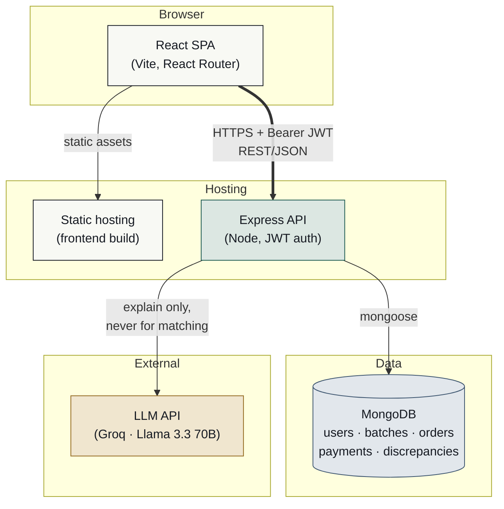
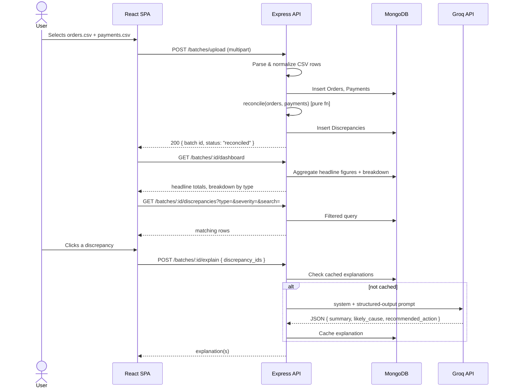
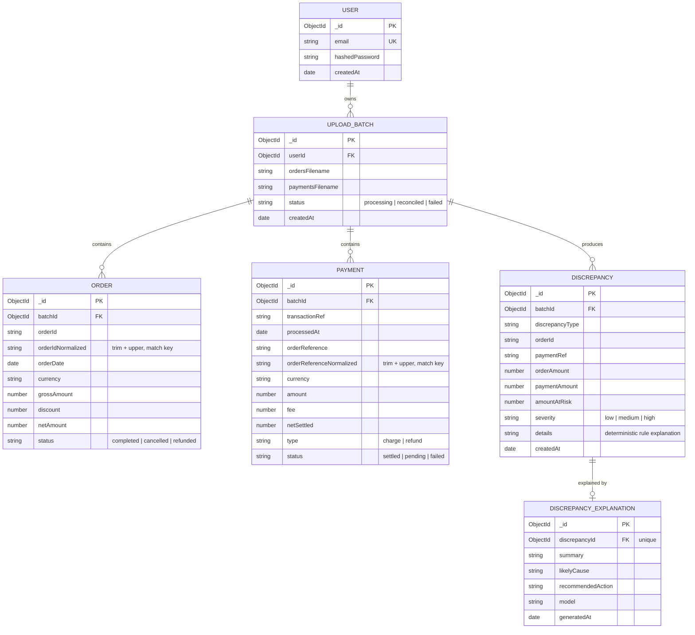

# Order/Payment Reconciliation Dashboard

A web app that ingests an orders export and a payments export, deterministically
reconciles them, and gives a revenue-owner a dashboard to see where the two
disagree — plus an LLM layer that explains each discrepancy in plain language.

**Live app:** `<fill in after deploy>`
**Backend API:** `<fill in after deploy>`
**Repo:** `<fill in after deploy>`

Test login: `<email>` / `<password>`, or use the sign-up form.

---

## Table of contents

- [Architecture](#architecture)
- [Data model](#data-model)
- [Getting started locally](#getting-started-locally)
- [Reconciliation logic](#reconciliation-logic)
- [What we found in the data](#what-we-found-in-the-data)
- [LLM integration](#llm-integration)
- [Auth & security](#auth--security)
- [Project structure](#project-structure)
- [What I'd build next](#what-id-build-next)
- [Use of AI tools](#use-of-ai-tools)

---

## Architecture

Two deployables — a static frontend and a stateless API — talking over HTTPS,
backed by MongoDB and (on-demand, for explanations only) an LLM API.



**Why this split.** The reconciliation engine is pure, synchronous, and has
no business talking to an LLM — it's a deterministic function of
`(orders, payments) → discrepancies`, tested and reasoned about independently
of anything AI-related. The LLM only ever runs *after* that function has
already decided what's wrong; it explains, it doesn't classify. This is
enforced structurally, not just by convention: `services/reconciliation.js`
has no import of `services/llm.js`, and `services/llm.js` never writes to
`Order`, `Payment`, or `Discrepancy`.

### Request flow: upload → reconcile → view



---

## Data model

Every `Order`, `Payment`, and `Discrepancy` is scoped to an `UploadBatch`,
and every `UploadBatch` is scoped to a `User` — that's what makes "users only
see their own data" enforceable at the query level rather than something the
UI merely hides (see [Auth & security](#auth--security)).



`DiscrepancyExplanation` is deliberately its own collection rather than
fields bolted onto `Discrepancy` — it keeps "what the rules engine decided"
and "what the LLM said about it" schematically separate, and it's what makes
explanations cacheable: reopening a discrepancy replays the same cached text
instead of re-rolling the model.

---

## Getting started locally

Requires Node 18+ and a MongoDB connection string (local `mongod` or Atlas).

```bash
# Backend
cd backend
npm install
cp .env.example .env      # fill in MONGODB_URI, JWT_SECRET, GROQ_API_KEY
npm run dev                # http://localhost:8000

# Frontend, in a second terminal
cd frontend
npm install
cp .env.example .env      # VITE_API_URL=http://localhost:8000
npm run dev                # http://localhost:5173
```

Sign up with any email/password (8+ characters) — there's no seed data or
admin account; each user's batches are private to them from the first upload.

---

## Reconciliation logic

**Matching key.** Orders and payments are joined on `order_id` /
`order_reference`, normalized with `trim().toUpperCase()`. This isn't
optional: the sample data contains the same order referenced as `ORD-1801`
in one file and `ord-1801 ` (lowercase, trailing space) in the other. Without
normalizing, that's a false "missing payment" and a false "orphan payment"
for the exact same real-world transaction.

**Grouping, not pairing.** A single order can legitimately have zero, one, or
several payment rows against it (a duplicate charge, a charge followed by a
refund, a charge followed by a partial refund). The engine groups all
payments per order first, then reasons about the group as a whole — it never
assumes one order maps to exactly one payment row.

**Tolerance.** Amount comparisons use a $0.05 tolerance
(`AMOUNT_TOLERANCE` in `services/reconciliation.js`). Anything within 5 cents
is treated as floating-point/rounding noise, not a real discrepancy — the
export data has values like `325.12` that don't round cleanly through
currency math. Anything past that is flagged.

**Discrepancy types:**

| Type | Meaning | Severity | Counted as "at risk"? |
|---|---|---|---|
| `missing_payment` | Order exists, no payment of any kind found for it | High | Yes, full order value |
| `duplicate_charge` | Same amount charged more than once for one order | High | Yes, the extra charge(s) |
| `amount_mismatch` | A settled charge exists but doesn't match the order's net amount | Medium/High (by size) | Yes, the difference |
| `failed_payment` | Order looks completed, but its payment status is `failed` | High | Yes, full order value |
| `pending_payment` | Order looks completed, but its payment is still `pending` | Medium | Yes, full order value |
| `cancelled_but_charged` | Order marked `cancelled`, but a settled, unrefunded charge exists | High | Yes, the charge amount |
| `currency_mismatch` | Order and payment currencies differ (no trustworthy FX rate to compare with) | High | Yes, flagged for manual review |
| `partial_refund` | Charged, then only part of it refunded | Medium/High | Yes, the shortfall |
| `full_refund` | Charged and fully refunded | Low/Medium | No — resolved, but flagged if the order's own status field wasn't updated to `refunded` |
| `orphan_payment` | A payment references an order id that doesn't exist in the orders file at all | Low (refund) / Medium (charge) | Yes for charges — money collected with no matching sale on the books |

**Why these tolerances and severities.** "At risk" is meant to mean *likely
real revenue leakage a human should look at*, not just *any disagreement*. A
`full_refund` where both sides agree is disputed value (it shows up in "in
dispute") but not risk — it's resolved, just imperfectly recorded. Severity
similarly tracks financial consequence rather than urgency in the abstract: a
`missing_payment` or `cancelled_but_charged` is high severity because it's
either lost revenue or a refund owed to a customer; a `pending_payment` is
medium because it may simply resolve once settlement completes.

---

## What we found in the data

The task said not to assume anything about the files until they'd actually
been inspected. What's actually wrong with them:

1. **Case/whitespace-inconsistent order references** — the same order is
   written differently across the two files (e.g. trailing spaces, mixed
   case). Naive string matching would misclassify these as both a missing
   payment and an orphan payment for what is really one clean transaction.
2. **Day-first dates in `payments.csv`** (`DD/MM/YYYY`) vs. ISO-ish dates in
   `orders.csv`. Parsing the payments date with a naive `new Date(string)`
   silently misdates any payment where the day is ≤ 12, with no error thrown
   — a correctness bug that would never surface as a crash, only as quietly
   wrong numbers.
3. **An exact-duplicate row in `orders.csv`** (same order id, same
   everything) — an export glitch, not two sales. Counted once, not twice.
4. **Real duplicate charges, partial/full refunds, failed and pending
   payments, cancelled-but-charged orders, at least one currency mismatch,
   and payments referencing order ids that don't exist anywhere in the
   orders file** (orphan payments) — these are the actual business-relevant
   discrepancies the reconciliation engine is built to surface, as opposed
   to the data-hygiene issues above, which are cleaned up during ingestion
   so they don't pollute the results.

**What it means for the business:** the money at risk isn't just "orders
without payments" — a meaningful share of it is refund exposure that the
order records were never updated to reflect (`full_refund`/`partial_refund`
cases where `status` still says something else), and orphaned charges that
exist in the payment processor but are invisible to the store's own order
system, which is as much a bookkeeping/compliance problem as a revenue one.

---

## LLM integration

- **Where it runs:** backend only (`services/llm.js`), never the frontend.
  The API key lives in the server's environment and is never sent to or
  readable by the client.
- **What it's allowed to do:** explain and summarize discrepancies that the
  deterministic engine already identified and classified. It is explicitly
  instructed not to reclassify `discrepancy_type` or second-guess
  `amount_at_risk` — those are passed in as given facts, not questions.
- **Structured output:** the model is prompted to return only
  `{"explanations": [...] }` with a fixed schema per item
  (`discrepancy_id`, `summary`, `likely_cause`, `recommended_action`).
  Responses are parsed defensively — malformed or missing fields raise
  `LLMExplanationError`, which the API turns into a `502` with a clear
  message rather than a raw crash, and the frontend renders that as an
  inline error in the explanation panel without blocking the rest of the
  discrepancy detail from displaying.
- **Temperature: 0.2.** Chosen deliberately, not left at a default. This is
  a finance-adjacent explanation someone might act on, so fluent but
  repetitive output is preferable to creative output — 0 read as overly
  terse/robotic in testing, and anything above ~0.3 started editorializing
  (guessing at specific causes the data didn't support, e.g. inventing "the
  customer's card was declined for insufficient funds" instead of saying
  "the payment failed").
- **Caching:** explanations are cached per discrepancy
  (`DiscrepancyExplanation`, unique on `discrepancyId`). Reopening a
  discrepancy replays the cached text instead of re-calling the model —
  keeps repeat dashboard visits fast, cheap, and stable (the explanation
  doesn't change on every page load).

---

## Auth & security

- Passwords are hashed with bcrypt (`bcryptjs`); nothing is ever stored or
  logged in plaintext.
- Sessions are stateless JWTs (`jsonwebtoken`), verified on every request by
  `middleware/auth.js`, which decodes the token, loads the user, and 401s on
  anything wrong (missing header, bad signature, expired, unknown user).
- **Data isolation is enforced at the query level, not the UI level.** Every
  batch-scoped route goes through `getOwnedBatch(batchId, userId)`, which
  filters by `{ _id: batchId, userId: req.userId }` — a request for a batch
  id that exists but belongs to someone else returns `404`, identical to a
  batch id that doesn't exist at all, so an attacker can't distinguish
  "not yours" from "doesn't exist."
- Login returns an identical error for "no such email" and "wrong password"
  to avoid leaking which emails are registered.
- The frontend never sends a user id to the API — it's always inferred
  server-side from the JWT — so there's no client-controlled parameter that
  could be tampered with to view someone else's data.

---

## Project structure

```
backend/
  src/
    config/db.js              MongoDB connection
    middleware/auth.js        JWT verification, req.userId
    models/                   Mongoose schemas
    services/
      ingest.js                CSV parsing & normalization
      reconciliation.js        pure, deterministic matching engine
      llm.js                   Groq call, prompt, structured-output parsing
    routes/
      auth.js                  signup, login
      batches.js                upload, list
      dashboard.js              headline + breakdown + discrepancy list
      explain.js                LLM explanations
    server.js

frontend/
  src/
    api/                       axios client + typed API wrappers
    context/AuthContext.jsx    JWT storage, login/signup/logout
    components/                table, filters, drawer, chart, forms
    pages/                     Login, Signup, Batches, Dashboard
    lib/format.js              money/date formatting, labels
```

---

## What I'd build next

- **Background processing** for the upload step. It's synchronous today,
  which is a deliberate scope call for files with hundreds of rows in a
  24-hour window — at real-world file sizes this needs a queue so the
  request doesn't block on parsing + reconciling + inserting.
- **Re-running a batch** against corrected source files, with a diff against
  the previous run, rather than every upload being a fresh, disconnected
  batch.
- **Bulk actions** on the drill-down table (e.g. mark a set of discrepancies
  reviewed/resolved), so the dashboard becomes a workflow tool, not just a
  read-only report.
- **Streaming the LLM explanation** rather than waiting for the full JSON
  response, since explaining a full batch of 25 can take a few seconds.
- **Configurable tolerances per user/store**, since a $0.05 amount tolerance
  and what counts as "high severity" are business judgment calls, not
  universal constants.

---

## Use of AI tools

`I used ChatGPT and Claude as development assistants for brainstorming, debugging, explaining APIs, and generating small boilerplate code. I manually implemented the core application logic, reviewed and modified all AI-generated code, and tested every change before committing to ensure it matched the project requirements and coding style.
`
